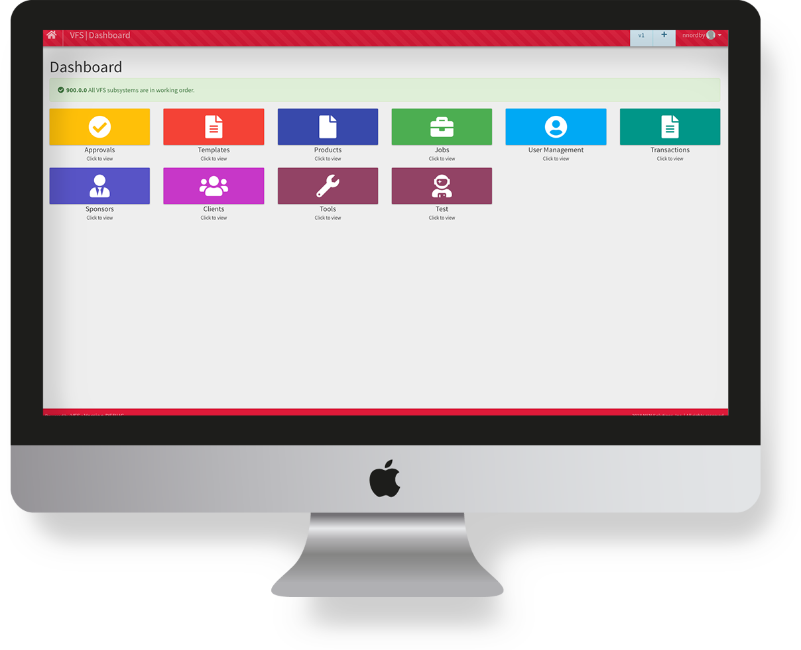

# Introduction to Velma.io

**[Velma.io](https://www.meetvelma.com/products/vfs)** is home to the Velma Fulfillment System, otherwise known as VFS.

    

The **[Velma application](https://www.velma.com)** is a marketing platform built around VFS which provides marketing capabilities to Enterprise Mortgage Banks and brokers and takes advantage of cross-media marketing capabilities; which include: physical print and mailing service, robust authenticated email, SMS, self print (desktop print), and personal gift fulfillment, all with the same convenience of simple API calls invoked from the client application.  The purpose of VFS is to provide a world-class fulfillment capability to applications whose primary mission focuses on other priorities but recognizes the value and need for these capabilities.
