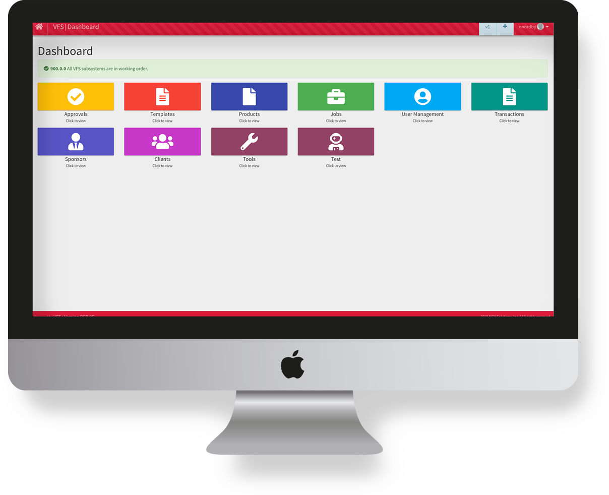

!!! quote "**Our mission is to help organizations grow and thrive by providing intelligent engagement solutions.**"

Velma.io is an intelligent engagement toolkit for applications or services.  Each tool can be invoked separately, or as part of an orchestrated communication strategy.

**[Velma.io](https://www.meetvelma.com/products/vfs)** is home to the Velma Fulfillment System, otherwise known as VFS.  The information on this site has been organized around supporting two primary users:

1. Solution Developers
2. Communication Administrators <small>([Get Started Here][1])</small>
[1]: libraries/introduction/

The information should be both technical but practical for all readers.  [Postman][2] collections are available throughout the site when more in-depth technical information is required.

<figure>
    
    <figcaption><small>Velma.io Admin Dashboard</small></figcaption>
</figure>

The **[Velma application](https://www.velma.com)** is a marketing platform built around VFS which provides marketing capabilities to Enterprise Mortgage Banks and brokers and takes advantage of cross-media marketing capabilities; which include: physical print and mailing service, robust authenticated email, SMS, self print (desktop print), and personal gift fulfillment, all with the same convenience of simple API calls invoked from the client application.  The purpose of VFS is to provide a world-class fulfillment capability to applications whose primary mission focuses on other priorities but recognizes the value and need for these capabilities.

[2]: getting-started/glossary.md
