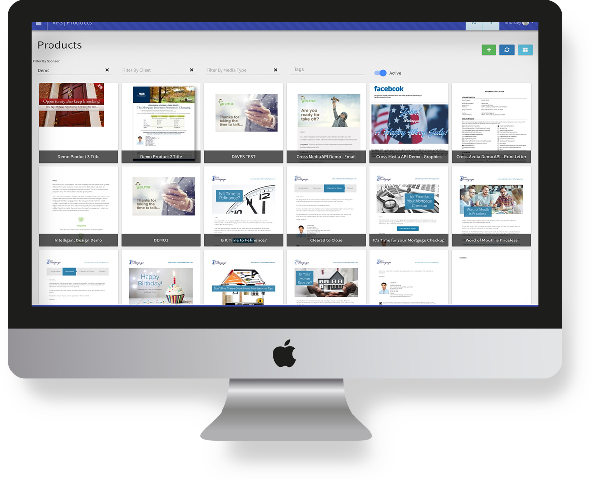

Content is the heart & soul of the Velma.io intelligent engagement toolkit.  Making a real connection with your audience for the purpose of driving engagement is behind the technology that has been created.  Making the message intelligent so that it speaks to the specific individual it is reaching should be the goal of each message that has been created.
We'll explore the different tools that are available to help you achieve this goal.

Individual documents that represent the communication message being delivered to an end consumer are called Products, and Products, collectively, make up a client or sponsor Library.

<figure>
    
</figure>

The Product page gives you the ability to manage and curate your content by letting you quickly filter by media type (print, email, SMS, etc), communication classification (marketing, transaction, notification, campaign), and tags you may have assigned to the product.  From this page you can select a product to edit or add a new product from scratch.

Products can be created from [Templates][1] which help drive the common elements from which a product is produced.  For example, if a set of products are going to be created that share a common style or graphic, a Template can be built that provides a framework, or 'template', that can make the creation of a lot of products with shared elements quick and easy.

[1]: templates.md
