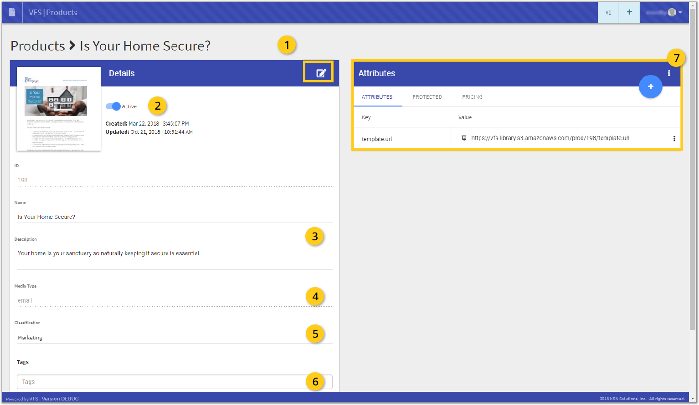

Document elements and what they mean and how they interact with each other.

<figure>
    
    <figcaption><small>Product View</small></figcaption>
</figure>

### 1. Edit

### 2. Status

### 3. Information

### 4. Medium

### 5. Classification

### 6. Tagging

### 7. Attributes
