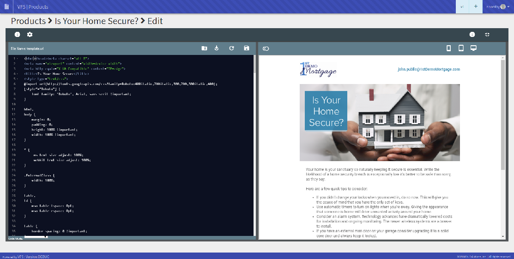

Document elements and what they mean and how they interact with each other.

### 1. Edit
The edit (#1) button allows you to edit the HTML or text of the product.

From here, you can view your changes in real-time and publish them live.

### 2. Status

### 3. Information

### 4. Medium

### 5. Classification

### 6. Tagging

### 7. Attributes
